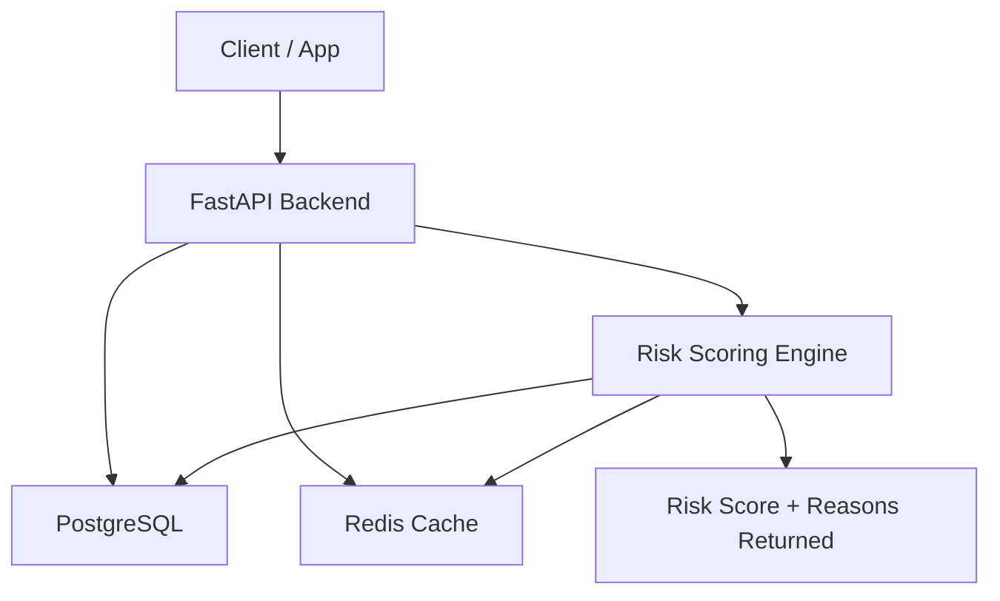

# Transaction Risk & Fraud Detection Engine

## 📌 Overview
The Transaction Risk & Fraud Detection Engine is a production-style backend system that evaluates financial transactions and assigns a fraud-risk score using rule-based and probabilistic signals.

Designed with FastAPI, PostgreSQL, Redis, SQLAlchemy, and Docker, the system features clean architecture, modular scoring, real-time evaluation, and scalable infrastructure.

## 🚀 Features
- **Real-time Fraud Scoring:** Assigns a score (0–100) with reasons and evidence.
- **Fraud Signal Detection:**
  - Amount spike detection
  - Velocity spike detection (1 min & 10 min windows)
  - Location mismatch (Haversine formula)
  - Device change monitoring
  - Merchant blacklist
  - Duplicate transaction patterns
- **Scalable Architecture:** Uses PostgreSQL, Redis, Docker, and modular code.
- **Production-Grade API:** FastAPI docs, idempotent submission, strong validation.
- **Testing:** PyTest suite, unit + integration, scoring validation.

## 🧠 How the Risk Engine Works
For every transaction, modular rules evaluate risk:

| Signal                | Description                          | Score |
|-----------------------|--------------------------------------|-------|
| Amount Spike          | Amount > 5× user’s average           | +30   |
| Velocity Spike        | ≥3 transactions in last 60s          | +25   |
| Velocity Unusual      | ≥5 transactions in 10 min            | +15   |
| Location Mismatch     | >500 km jump within 12 hours         | +20   |
| Device Change         | New/suspicious device ID              | +10   |
| Merchant Blacklist    | High-risk merchants                    | +40   |
| Duplicate Transaction | Same amount + merchant in 30s         | +35   |

Final scores are clamped 0–100. Stored data: risk score, reasons, raw evidence, timestamps.

## 🏗️ System Architecture


## 🛠️ Tech Stack
| Layer          | Technology                   |
|----------------|-----------------------------|
| Backend        | FastAPI (Python)            |
| Database       | PostgreSQL + SQLAlchemy ORM |
| Cache          | Redis                       |
| Containers     | Docker + docker-compose     |
| Testing        | PyTest                      |
| Docs           | FastAPI OpenAPI UI          |

## 📦 Project Structure
```
transaction-risk-engine/
├── app/
│   ├── main.py
│   ├── api/routes.py
│   ├── scoring/engine.py
│   ├── db/models.py, session.py
│   ├── cache/redis_client.py
│   └── tests/test_scoring.py, test_api.py
├── Dockerfile
├── docker-compose.yml
├── requirements.txt
├── README.md
└── .gitignore
```

## 🐳 Getting Started

### Run with Docker (Recommended)
```bash
docker-compose up --build
```
- API: [http://localhost:8000](http://localhost:8000)
- Swagger docs: [http://localhost:8000/docs](http://localhost:8000/docs)

### Run Locally (No Docker)
```bash
pip install -r requirements.txt
uvicorn app.main:app --reload
```

## 🧪 Testing
Run all tests:
```bash
pytest
```
Coverage:
- scoring rule tests
- API endpoint tests
- edge-case simulations

## 🔌 API Endpoints

### Submit Transaction
`POST /transactions`
```json
{
  "transaction_id": "tx1",
  "user_id": "user_123",
  "amount": 9999.99,
  "currency": "INR",
  "merchant_id": "m_100",
  "timestamp": "2025-12-03T09:00:00Z",
  "location": {"lat": 19.07, "lng": 72.87},
  "device_id": "dev_x"
}
```

### Fetch Risk Score
`GET /risk/{transaction_id}` – fetch risk score + reasons.

### List High-risk Transactions
`GET /flags?min_score=70` – all flagged transactions.

### Health Check
`GET /health` – DB + Redis status.

---

## 🙋 Authors 
- **Author:** [Sa1385](https://github.com/Sa1385)

---